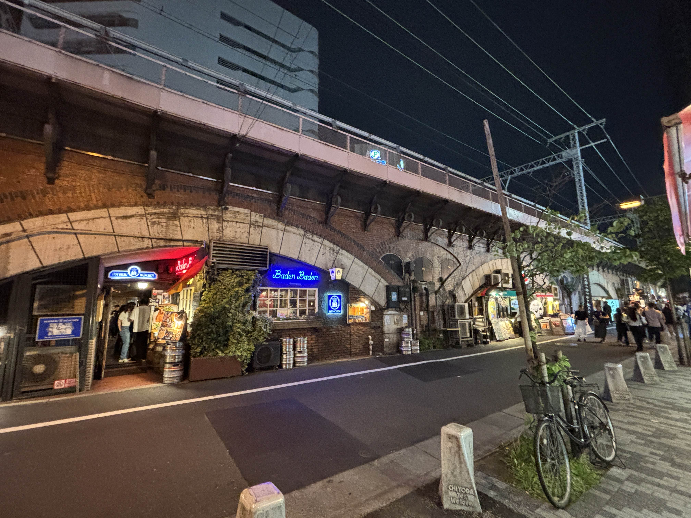
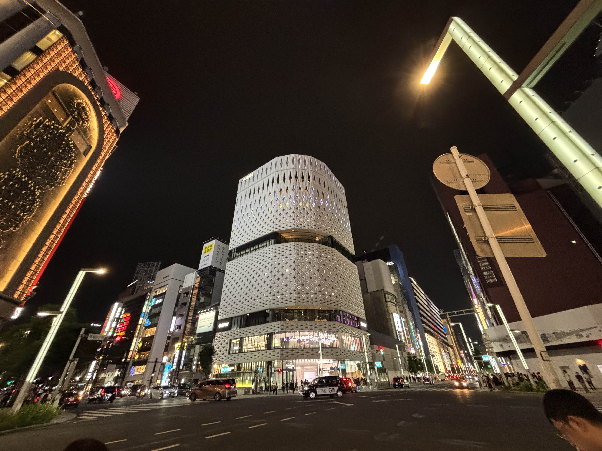
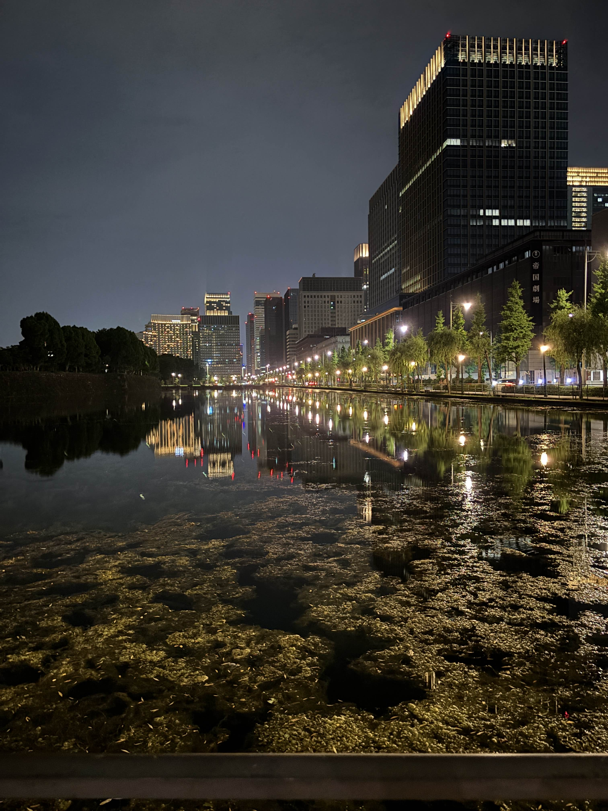

## 概要
ここ数日、運転したりMisskey.io飲酒部員と飲みに行ったりと、割と楽しい日々を送っていたので、それの過去ログ的なものとなります。

## 初運転！
ついにやってきました‼️

思えば運転免許取得までも9ヶ月近くかけているので、本当に夢が叶ってハッピ〜。ルートは江東区内あたりぐるっとした後に、レインボーブリッジの下とか、ゲートブリッジの上走るみたいな感じで所要時間は3時間弱ってとこでしょうか。

あいにくの大雨だったんですが、路上教習と変わらず落ち着いて運転ができたと思います。ただ、日本橋、東京駅周辺はなかなかカオスで、教習所で1回も見たことない、1番左左折専用、真ん中直進専用、右2車線右折専用みたいなことになってました。

僕が初心者マークだからか、割とみんな入らせてくれて優しいな〜となるなどしました。 

<small>カーシェア+初心者マークの役満車両に近づきたくないだけかもしれんけど</small>

少し憧れあったサンキューハザードのやりとりもたくさんできたから楽しかった🤩

## 飲酒部員と飲み

もう何回目になるかわからない、飲酒部員と飲みに行ってきました。今回は、先日京都で会ったフォロワーが東京に来てるから！ということでお誘いいただいたので、有楽町のドイツ料理屋「バーデンバーデン」と、銀座のウォッカバーに行ってきました。

バーデンバーデンという店、有楽町の高架下にあるのですが、やはりというかなんというか、酒好きな両親は何回も行っていたらしく、うんちくを語られました。

料理はとても美味しかったし、お酒も普段缶で飲むよりは当然美味しくとっても満足度高かったです‼️Misskeyにいるオタクらしく、いつものにゃんぷっぷー並べて撮影みたいなのもしてきました。僕は財布とスマホ以外一切持たない手ぶらスタイルだったので、僕のにゃんぷぷはお家でお留守番しています。

2軒目のウォッカバー、銀座にあるということでそこそこ緊張してたんですが、やっぱりドレスコードとかない分雰囲気は緩めで楽しかったし、何よりウォッカとカクテル各種がとても美味しかった！

ミハさん、音名無しさん、色々とありがとうございました！ご馳走様です。

お金無さすぎるのが苦しいですけど、やっぱりバーは連れて行っていただくたびに楽しさ更新されててすげえな〜となってます。来月もバーに行く予定があるので楽しみ😊

## 終わり
インターネットやゲーム以外の楽しみが色々開拓された1週間だったかなと思います。ただ、やっぱり外に出るとそれ相応にお金がかかるので、バーや飲みも運転も、なかなか苦しいものがあります。でもやっぱ楽しいからまたやりたいね〜

## おまけ写真集

