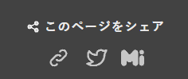

## 概要

タイトル通りです。このブログはHugo製で、Stackというテーマを適用して作っています。Stackテーマは改造等割と自由なので、試しにシェアボタンを実装してみるかと思いやってみました。

HTMLとCSSの知識、あとはHugoに関するドキュメントを調べる能力があれば行けると思います。今後色々追加する自分向けの備忘録として、この記事では簡単にやり方を書きます。Stackテーマに限らず、Hugo製ページの構造を少し理解していれば、どのテーマでも同じように改造ができると思うので、よければ参考にしてください。

step by stepのような解説ではなくあくまでメモなので、コードが気になる方は[このブログのリポジトリ](https://github.com/Kohxax/bokukoha-hugo-blog)を見てみてください。

## 前提知識

Hugo、少なくともStackテーマでは、`./themes/layouts`内にページやウィジェットなど各種ページを構成するパーツがまとめて入れられていて、そのパーツを`./themes/layouts/_default/single.html`や`./themes/layouts/partials/article/article.html`なんかで読み込んで実際のページを作るという感じの動作をしています。

Hugoの公式ドキュメントによれば`./layouts`というディレクトリを作り、その中にthemes内と同じディレクトリ構造を作ってあげれば任意のパーツを上書きしたり、あるいは新しいパーツを追加して読み込むなんてことができるようになります。今回のシェアボタン追加は後者の方をやっていきます。

## やり方

`./layouts/partials`内に`social-share.html`を作成します。