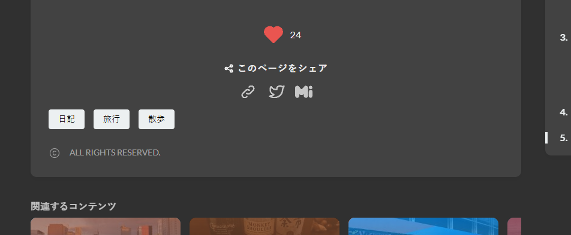
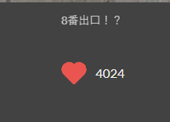

## 概要
[以前実装したシェアボタン](https://blog.bokukoha.dev/p/hugo--stack%E3%81%AE%E3%83%96%E3%83%AD%E3%82%B0%E3%81%AB%E3%82%B7%E3%82%A7%E3%82%A2%E3%83%9C%E3%82%BF%E3%83%B3%E5%AE%9F%E8%A3%85%E3%81%97%E3%81%9F/)に引き続き、いいね機能があってもいいかもな～となったのでそれを実装したメモとその苦労話的な感じのものです。6月頃に参加したAWS summitでAWSの簡単な使い方なんかを学習してきたので、いい機会だし早速使ってみようということで、今回はAWSの各種機能を活用していいねボタンを実装してみました。



## 中身

<strong>機能</strong>
- ユーザーがいいねボタンを押す
- いいねボタンが押されたらDBに記録する
- DBに記録されたらdiscordに通知を飛ばす
- いいねが押された回数をDBから取得して、ブログ側で表示する

<strong>使ったもの</strong>
- Lambda
- API Gateway
- DynamoDB

とまあこのように、いたってシンプルな感じの機能です。[以前のシェアボタン](https://blog.bokukoha.dev/p/hugo--stack%E3%81%AE%E3%83%96%E3%83%AD%E3%82%B0%E3%81%AB%E3%82%B7%E3%82%A7%E3%82%A2%E3%83%9C%E3%82%BF%E3%83%B3%E5%AE%9F%E8%A3%85%E3%81%97%E3%81%9F/)の時同様、`./layouts/partials`内にhtmlファイルを作り、適当にボタン部分とスタイルを作り、AIに書いてもらったAPIを叩くコードを張り付けてフロント側は完成です。

<details>
<summary>弊ブログで使っているコード例（JS）</summary>

```
<script>
    document.addEventListener('DOMContentLoaded', () => {
        const apiEndpoint = '{{ site.Params.apiEndpoint }}';
        const apiKey = '{{ site.Params.apiKey }}'; // 設定ファイルからAPIキーを読み込む
        const articleId = '{{ .RelPermalink }}';

        const likeButton = document.getElementById('like-button');
        const likeCountSpan = document.getElementById('like-count');

        if (!likeButton) return;

        // リクエストに含めるヘッダーを作成
        const requestHeaders = {
            'x-api-key': apiKey
        };

        // ページ読み込み時のいいね数取得（ヘッダー付きでfetch）
        fetch(`${apiEndpoint}/${encodeURIComponent(articleId)}`, { headers: requestHeaders })
            .then(res => {
                if (!res.ok) throw new Error(`HTTP error! status: ${res.status}`);
                return res.json();
            })
            .then(data => {
                likeCountSpan.textContent = data.likes || 0;
            })
            .catch(err => console.error('いいね数取得失敗:', err));

        // ボタンクリック時の処理
        likeButton.addEventListener('click', () => {
            likeCountSpan.textContent = parseInt(likeCountSpan.textContent) + 1;

            // いいねを送信（ヘッダー付きでfetch）
            fetch(`${apiEndpoint}/${encodeURIComponent(articleId)}`, {
                method: 'POST',
                headers: requestHeaders // ここにもヘッダーを追加
            })
            .then(res => {
                if (!res.ok) throw new Error(`HTTP error! status: ${res.status}`);
                return res.json();
            })
            .then(data => {
                likeCountSpan.textContent = data.likes;
            })
            .catch(err => {
                likeCountSpan.textContent = parseInt(likeCountSpan.textContent) - 1;
                console.error('いいね送信失敗:', err);
            });
        });
    });
</script>
```

</details>

上のコード内にもあるように、`{{ site.Params.hogehoge }}`を使ってブログのconfig.yamlに追加した要素を読み込んでくれるようにしておきました。コード内に直で書こうが、configから読むようにしようが、githubで公開している以上はエンドポイントもキーも見られちゃうわけなんですが、気持ち悪かったのでconfigから読む形式にしました。

## 苦労した点

前述のフロントエンドの方で苦労したことは一切と言っていいほどなかったんですが、今回のメインであるAWSの方は結構詰まった点が多かったのでそれを書いていきます。

### 与太話1
LambdaのコードなんかはAIにベースを書かせて、少しだけ自分で手直しをしてあげただけでテストで動いてくれたので良かったんですが、API Gatewayがかなりの曲者でした。いいねボタンを実装した当初は、設定が面倒くさかったこともあり、キーを使わずエンドポイントURLだけでapiを叩けるようにしていました。

機能が完成して開発サーバーでテストOK、いざ外部公開用の本番で公開してmisskey（SNS）にてその旨を告知したところ、知り合いの某エンジニアに、エンドポイントだけでレート制限かかってないのをいいことにAPIを一生叩き続けていいねスパムを送るbotを作られ、いいね数がとんでもないことになってしまいました。



流石にこれはマズイと思ったのでAPIキーを発行しレート制限をかけ解決したんですが、API gatewayの使用量プランとキーとAPI本体を紐づける作業がなかなか複雑だったのがつらかったです。今はもう理解したので詰まることはないんですが、初見だとAPIに対応するキーを発行して、使用量プランを作成して、プランとキーを紐づけて……という作業が難解でした。

API側でレート制限をかけるだけではなく、フロントのコード側でも10回いいねが押されたらそのブラウザからは押せないようにしたので多少のスパム対策にはなったのかなという感じです。

### 与太話2

つい先日記事を投稿した際、何故かいいねボタンが壊れていいねが取得できていないことに気が付きました。ブラウザの開発者モードでコンソールを見てみると、`No 'Access-Control-Allow-Origin' header`のエラー。これはAPI gatewayのCORSというアクセス制限をかける機能が原因なのではないか？と調べる中でわかったので、CORSを再設定しました。

これで治ったかと思うと今度はコンソールに`429 Too many request`のエラー。1回押すだけでエラーが出てしまうのでこれは異常だと思い、使用量プランをオフにしたり、そもそもプランを削除したりしましたがそれでもエラーが消えず頭を抱えてしまいました。最終的にAPIキーを再発行することで絵429は消えましたが、今度は`403 forbidden`のエラー。

結論から言うとこれは再発行したAPIキーをAPI本体に紐づけることを忘れていたことによる認証エラーだったのですが、これに気付くまでにそこそこ時間がかかりました。

## おわりに
AWSの無料枠で実用的なものを作る経験はそんなになかったので勉強になりました。以前作ったS3へのマイクラデータのバックアッププラグインなんかはS3だけしか使っておらず、今回のようにいくつかの機能を連携させるのは初めてで楽しかったです。

エラーで頭を抱えたと書きましたが、この手の問題解決は結構楽しいので意外と好きだったりします。本業で使ってる方々から見ると結構しょぼい機能な気がしますが、自分的に満足のいくものを作れたので良かったです。

ここまで駄文を読んでくださりありがとうございました。良ければ下のいいねボタンを押していってください。僕が喜びます！

### おまけ

今回のいいね機能はLambdaを活用したサーバーレスなコード実行という点でAWSを使うメリットが明確なものだったので勉強にちょうどよかったのが助かりました。実は以前EC2やVPCなんかを使ってマイクラサーバーを構築する計画があったんですが、EC2の無料枠がしょっぱ過ぎた（RAM1GBのVMしか使えない；；）ことが理由で諦めていました。やっぱり趣味で動かすゲームサーバーなんかはオンプレでやるのが一番楽なのかな～なんて思ったり。

