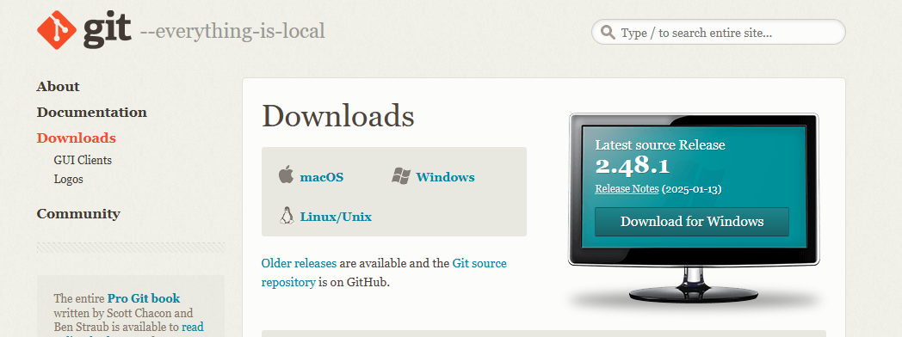
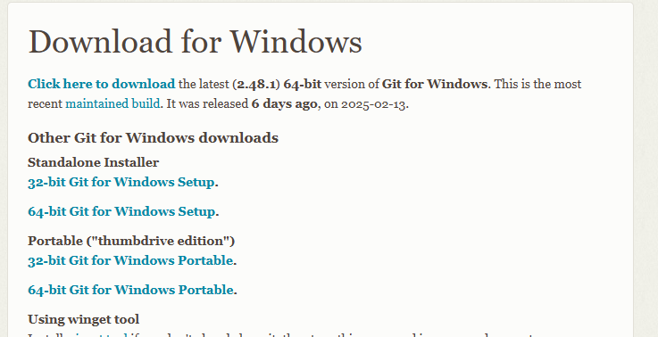
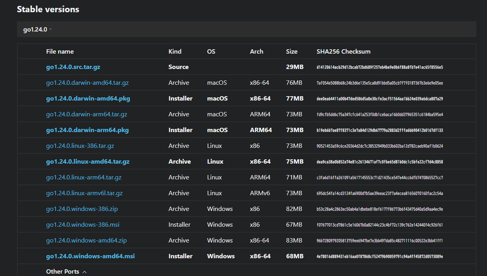
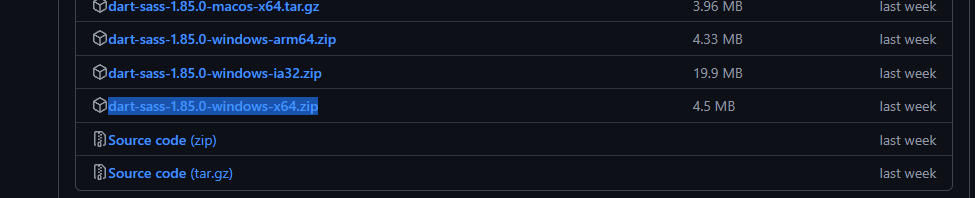
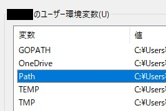

## はじめに
この記事では弊ブログサイトを作るにあたって参考にした記事や公式ドキュメントを紹介する。誰でもわかりやすいような解説を目指すが、あくまでも備忘録であるため個別の質問等には応じられない可能性がある。

Hugo + jimmy氏作のStack themeを使用してブログページを作り、windows11のVisual Studio Codeからgithubのレポジトリにcommit&push、そしてcloudflare pagesでビルドとデプロイをすること目標としているものと想定して解説をする。


## 目次
- 筆者の環境
- 開発環境
- Hugoのインストール
- Hugoでプロジェクト作成
- テーマ追加
- 投稿作成
- その他
- Cloudflare Pagesでの設定

## 筆者の環境
・Cloudflareでドメイン取得済み <br>
・メインPCのOSはWindows11 <br>
・webアプリの知識は皆無（jsすらわからない） <br>
・Cloudflare tunnelやpagesはある程度の利用経験あり
・linux及びwindowsの最低限のコマンド知識はあり（ディレクトリ移動やnano、touchなど）

## 開発環境

**結論 : Windows使ってるならWindowsで作ろう**

当初は自鯖でホスティングしようと思っていたため、Proxmox上にLXCを建てて開発環境を作った。しかし、結局Cloudflare Pagesを利用したため、開発環境はWindows11（x64）で作るものとする。 <br>
Cloudflare Pagesを使わずにgithubのwebhookを使ってビルドとデプロイを自動化するスクリプト書こうと思えるなら話は違うけど、楽に作るならcloudflare pagesがオススメ。

## Hugoのインストール
基本的にHugoの[Windows用公式Doc](https://gohugo.io/installation/windows/)に沿って書くだけなので、これが読めてわかる人は読み飛ばしてもらっても問題ないかも。

### 前提条件

Hugoをインストールする前に、いくつか必要になるものがあるためそれらをインストールする。

#### gitのインストール
①まずgitの[ダウンロードページ](https://git-scm.com/downloads)にアクセスする。

②**Windows**を選択する



③**64-bit Git for Windows Setup**を選択する。



④ダウンロードされた`Git-x.xx.x-64-bit.exe`を起動し、gitをインストールする。

⑤windowsのコンソールで
```
git --version
```

と入力し、`git version x.xx.x`の様な出力が得られればOK。

#### Goのインストール

①Goのインストーラー[ダウンロードページ](https://go.dev/dl/)にアクセスする。

②Stable versionsリスト内から`gox.xx.x.windows-amd64.msi`を探してダウンロードする。



③ダウンロードしたインストーラーを起動し、Goをインストールする。

④Gitと同様にWindowsのコンソールで
```
go version
```

と入力し、`go version gox.xx.x windows/amd64`の様な出力が得られればOK。

#### Dart Sassのインストール

①Dart Sassの[公式GitHubリリースページ](https://github.com/sass/dart-sass/releases)にアクセスする。

②最新バージョンのリリースからWindows用のzipファイル（例`dart-sass-1.85.0-windows-x64.zip`）を探してダウンロードする。



③ダウンロードしたzipファイルを解凍し、中身の`dart-sass`フォルダをわかりやすい場所（例 Cドライブ直下等）に配置する。

③Windowsの検索メニューから**環境変数を編集**のウィンドウを開く。

④ウィンドウ内のユーザー環境変数 or システム環境変数から`Path`を選択し**編集**をクリックする。



⑤**新規**をクリックし、入力を求められている部分に②で配置したdart-sassフォルダのパスを入力する。（例 Cドライブ直下に配置していた場合は、`C:\dart-sass`）

⑥前述の2つと同様に、Windowsのコンソールで
```
sass --version
```

と入力しｍ`x.xx.x`の様な出力が得られればOK。

### Hugo本体のインストール

前述の前提条件が全て揃っていることが確認出来たら、いよいよHugo本体をインストールする。

とはいってもこれは簡単で、Windowsのコンソールで
```
winget install Hugo.Hugo.Extended
```
と入力するだけでOK。特に問題が無ければ無事インストールが完了するはず。

インストール終了後は、前提条件同様にコンソールで

```
hugo version
```
と入力し、出力が得られることを確認することを忘れずに。

#### 注意事項

前項で得られたバージョン出力が`0.123.0`より大きい数字であることを必ず確認すること。`0.123.0`はこの後導入するStackテーマが動作する最低バージョンであるため、これが小さい数字になっているとテーマがうまく動作しなくなる。

## Hugoでプロジェクト作成

①ブログを作りたいディレクトリ内（例 Cドライブ直下）でコンソールで

```
hugo new site your_blog_name
```

と入力しよう。すると`C\:your_blog_name`というHugoのプロジェクトフォルダが作成される。`your_blog_name`は任意の名前に変えること。

②

## テーマ追加

## 投稿作成

### 投稿テンプレートの作成

## その他

## Cloudflare Pagesでの設定