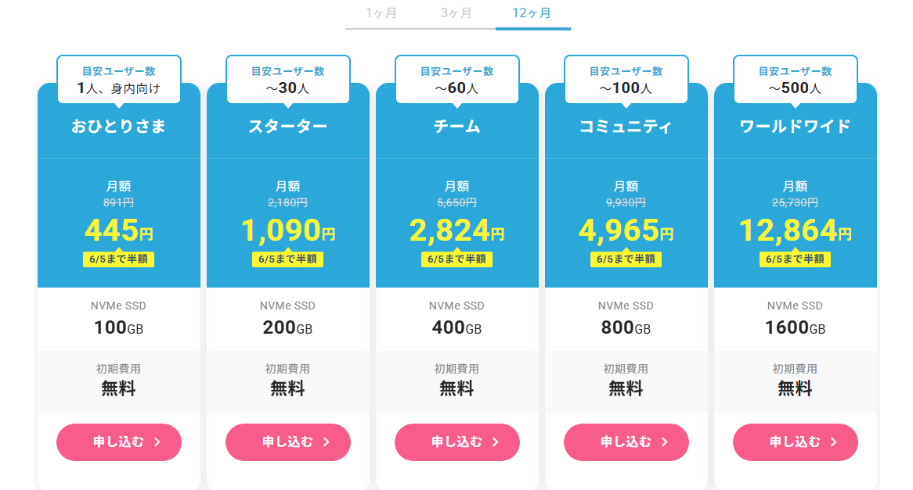
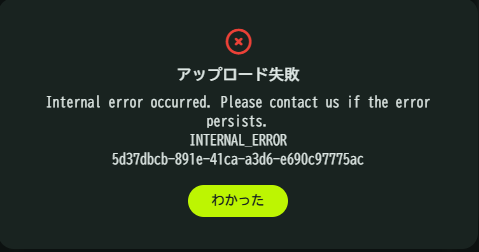

## 概要

タイトル通りです。言っちゃえばMisskey公式ドキュメントの[「Docker Composeを使ったMisskey構築」のページ](https://misskey-hub.net/ja/docs/for-admin/install/guides/docker/)をなぞりつつ、僕が詰まった箇所を少し解説するだけなので、公式ドキュメントを読める人はこの記事を読む必要はないと思います。自鯖を動かすうえで絶対に必要な部分だけを解説します。

外部公開にはCloudflare tunnelを使います。公式ドキュメントではNginxを使っているはずだからそこだけ異なってるかも。

## 前提

- 筆者は非エンジニア
- サーバーのOSは`Ubuntu Server 22.04 LTS`を使った
- Cloudflareでドメインを取得している
- コピペができる

## やってみよう

ステップを大まかに分けると、

- Misskeyを動かすサーバーの用意
- Git, Docker, Cloudflaredとかのインストール
- Cloudflare tunnelの作成
- Misskeyのリポジトリ取得
- Configいじり
- Dockerコンテナの準備
- 初期設定

という感じです。下3つは解説通りにやればいいだけなので、一番難易度が高いのはMisskeyを動かすサーバーの用意な気はします。とはいっても、Xserverさんとかがサーバーを安価で提供してくれるので、そういったものを使えば解決するかな？



参考 :　[XserverのMisskey料金ページ](https://sns.xserver.ne.jp/misskey.php)

サーバーについてはXserverや自宅サーバーを組んで解決したものとして次のステップから解説を続けます。

参考 : 　[3万円で作る自宅サーバー](https://blog.bokukoha.dev/p/3%E4%B8%87%E5%86%86%E3%81%8F%E3%82%89%E3%81%84%E3%81%A7%E4%BD%9C%E3%82%8B%E8%87%AA%E5%AE%85%E3%82%B5%E3%83%BC%E3%83%90%E3%83%BC/)

ドメインは`.dev`で年間2000円くらいです。別に持ってて損するわけでもないし、せっかく外部公開するならドメインは合った方が良いという話。

## Git, Docker, Cloudflaredとかのインストール

何をどう頑張っても必要になるのでインストールします。尚、インストールコマンドなどは前提にあるようにUbuntu基準で記述するので、各自の環境に合わせてください。

GitもDockerもCloudflaredも、全部WindowsからLinuxまで広く対応しているので、導入はできるはずです。

### Gitのインストール

```
sudo apt update
sudo apt -y install git
```

を実行してgitをインストールします。

```
git --version
```

で、バージョンが出力されることを一応確認してください。

### Dockerのインストール

Dockerのインストールに必要なパッケージをインストールします。

```
sudo apt update
sudo apt install -y ca-certificates curl gnupg lsb-release
```

Docker公式のリポジトリを追加します。

```
curl -fsSL https://download.docker.com/linux/ubuntu/gpg | sudo gpg --dearmor -o /usr/share/keyrings/docker-archive-keyring.gpg
echo "deb [arch=$(dpkg --print-architecture) signed-by=/usr/share/keyrings/docker-archive-keyring.gpg] https://download.docker.com/linux/ubuntu $(lsb_release -cs) stable" | sudo tee /etc/apt/sources.list.d/docker.list > /dev/null
```

Docker EngineとDocker CLIをインストールします。

```
sudo apt update
sudo apt install -y docker-ce docker-ce-cli containerd.io
```

Dockerがインストールされているか確認します。出力が得られればOK。

```
sudo docker --version
```

Docker Composeをインストールします。

```
DOCKER_COMPOSE_VERSION=$(curl -s https://api.github.com/repos/docker/compose/releases/latest | grep 'tag_name' | cut -d '"' -f 4)
sudo curl -L "https://github.com/docker/compose/releases/download/${DOCKER_COMPOSE_VERSION}/docker-compose-$(uname -s)-$(uname -m)" -o /usr/local/bin/docker-compose
```

スクリプトの実行権限を付与します。

```
sudo chmod +x /usr/local/bin/docker-compose
```

Docker composeのインストールを確認します。こちらも出力が得られればOK。

```
docker-compose --version
```
### Cloudflaredのインストール

[Cloudflareのダッシュボード](https://one.dash.cloudflare.com/)にアクセスし、ネットワーク>Tunnelsから、トンネルを作成します。

環境の選択から、今回の場合はUbuntuなのでDebianの64bitを選択し、下に表示されたコマンドをコピペして実行します。


## Cloudflare tunnelの作成

パブリックホスト名タブから、「追加する」をクリックします。


サブドメイン、ドメインに自分が決めたドメインを入力します。サービスのタイプはHTTP、URLはdockerを実行しているサーバーのローカルIPアドレス（例: 192.168.1.100など）にmisskeyのポートを指定したものを入力します。


デフォルトだとmisskeyのポートは3000なので、ローカルIPが`192.168.1.100`なら、URLには`192.168.1.100:3000`と入力すればOK。

## Misskeyのリポジトリ取得

いよいよMisskey本体のインストール作業です。rootディレクトリなど、misskeyのフォルダを置いておきたいディレクトリ内で実行してください。デフォルトだとログインしているユーザーのフォルダ内のはず。

以下コマンドでgithubからリポジトリを取得し、中身が間違っていないか確認します。

```
git clone -b master https://github.com/misskey-dev/misskey.git
cd misskey
git checkout master
```

## Configいじり

これらを実行し、各種初期設定ファイルのサンプルを本番用としてコピーします。

```
cp .config/docker_example.yml .config/default.yml
cp .config/docker_example.env .config/docker.env
cp ./compose_example.yml ./compose.yml
```

`./misskey/.config`内で`default.yml`と必要に応じて`docker.env`を編集します。

- `default.yml`内で絶対に変更する箇所

恐らく一番上にあるであろう`url:`の部分。ここは、自分が建てるmisskeyサーバーのURLを入力してください。最終的に公開するURLを`misskey.example.com`にするなら、以下のようになるはず。

```
# Final accessible URL seen by a user.
# You can set url from an environment variable instead.
url: https://misskey.example.com/
```

- `docker.env`の編集

基本的にここでいじる可能性があるのは、データベースの名前、ユーザー名とパスワードだと思います。

Misskeyを動かすだけなら編集は必須ではありませんが、いずれかを変更した場合は`default.yml`内、以下例の`Database`から始まる三要素を`docker.env`の内容に合わせることを忘れないでください。

```
  # Database name
  # You can set db from an environment variable instead.
  db: DatabaseName

  # Auth
  # You can set user and pass from environment variables instead.
  user: DatabaseUser
  pass: DatabasePassword
```

## Dockerコンテナの準備

下記コマンドを実行してMisskeyのビルドとデータベースの初期化をします。5分くらいかかるので、お手洗いにでも行きましょう。筆者は`docker.env`と`default.yml`の内容を合わせるのを忘れて、ここでエラーが起きました。

```
sudo docker compose build
sudo docker compose run --rm web pnpm run init
```

上記作業が終わったことが確認出来たら、次のコマンドでMisskeyを実行できます。

```
sudo docker compose up -d
```

configで設定したアドレス、もといCloudflare tunnelで設定したアドレス（例 : `misskey.example.com`）に接続して初期設定画面が表示されることを確認しましょう。


今回は初期設定開始用パスワードは特に設定していないので、空白のまま管理用アカウントのユーザー名とパスワードを新規作成してあげればOKです。

## 初期設定

管理者用アカウントやロール設定については調べて解決してくれとしかいうことがないので置いておきます。ここでは、Docker環境でMisskeyを実行することによって起きるエラーの解決方法を備忘録として載せておきます。

それと、その他の初期設定について役立ちそうなことも載せておきます。

### エラー内容



こんな感じで、アイコンやバナー、通常ノートで画像をMisskeyにアップロードしようとすると`INTERNAL_ERROR`が起きてしまう問題を解決します。

このエラーの原因はDockerのコンテナが、コンテナ外の./misskey/filesにアクセスする権限がないせいで起きるものなので、フォルダへのアクセス権限を与えてやれば解決します。

misskeyディレクトリ内、Dockerコンテナ外で以下コマンドを実行するだけでOKです。

```
chown -hR 991.991 ./files
```

### サーバーのアイコンとか


基本的にコントロールパネル>ブランディングから変更できます。ローカルの画像からパス指定ではなく、URLで画像を指定しなくてはいけないので、画像の直リンクが必要になります。

僕は、Google Photoにアップロードした画像をシェアリンクから直リンクに[変えてくれるサイト](https://www.labnol.org/embed/google/photos)を使ってURLを作成し、それをブランディング欄では使いました。

サイズみたいな注意事項はMisskey側で書いてくれているので、それに従っておけば間違いないです。

## おわりに

あとやることと言えば照会からフォローしたい人の@ユーザー名@ホストサーバー名を入れてフォローするだけなので、特に解説することはないと思います。とにかくDockerで作るのがあまりにも簡単すぎるので、そのうち全部ローカルで構築してみたいなあとは思ったりしています。

できるだけわかりやすく書いたつもりですが、結局のところ自分用の文章なのでわかり辛いところがあると思います。もしこの記事を読んでMisskeyの自インスタンスの作成にチャレンジする方がいれば、わからないことは是非質問してください。わかる範囲で頑張って答えます。では、またいつか👋

[連絡先など](https://www.bokukoha.dev/)