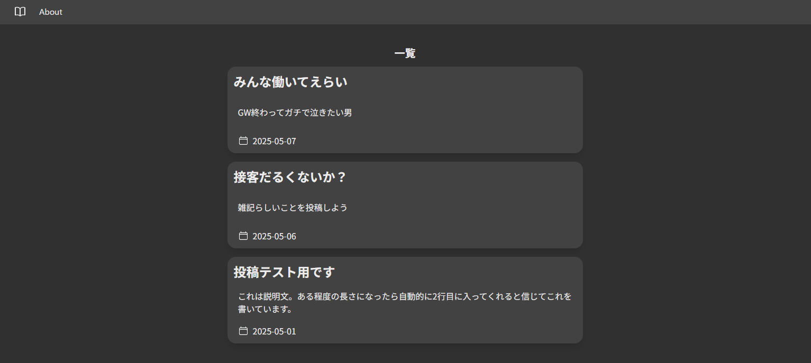

## できた


[GitHubのリポジトリ](https://github.com/Kohxax/bokukoha-novel)

## なんで作ったのか
作ってみたかったからです。というのはあまりにも味気ないので、理由らしい理由を書こうと思います。

もともとブログを作ろうというのはずーっと前から考えていたんですが、今皆さんが読んでくれているこのサイトを、思ったよりも楽にそして良いデザインで構築することができたので、わざわざ自作をする必要がなくなりました。

ですが、「やっぱ自作してぇ～～～」という気持ちが止まらなかったので、別にこちらと内容を分けるわけではないですが、遊びがてら作ることにしました。

それと、当初は僕がオタクをしているコンテンツのキャラ妄想みたいなのを適当に投げるサイトを作るという構想だったんですが、やってるうちに「雑記帳で良くね？これ」となり結局ブログ（その2）が作られることになってしまいました。

## 使ったもの
- Nuxt
- Nuxt Content
- Tailwind CSS

基本この三種類です。開発鯖はProxmoxのLXCで適当に立ててやりました。以前プロフサイトを作るときにVueを使ったので、少しだけとはいえ見慣れてるものを使おうってことでNuxtを触ってみました。

最終的に作るものが静的サイトなのだから、このブログで使われてるHugoのような静的サイトジェネレータを使えばいいだろって話なんですが、自分で1から作ってみるのも楽しそうだったので…

他に比べる対象がないのでなんともですが、Nuxtのドキュメントは割とわかりやすいなと感じました。JavaScriptやTypeScriptの知識ほぼ0の僕のような人でも一応形は作れたので。

## 機能とか
Nuxt Contentは、Contentの名の通りMarkdownからページを生成してくれる優れものです。Nuxtのルーティング機能なんかを使ってあげれば、4行程度のTypeScriptのコードと.vueファイルの中身を少し書くだけで動くブログが作れます。

```
<script setup>
const slug = useRoute().params.slug
const { data: post } = await useAsyncData(`content-${slug}`, () => {
  return queryCollection('content').path(`/${slug}`).first()
})
</script>
```

Markdownの内容を表示するページ本体のTSのコードです。マジでこれだけです。root/content内部の.md等のファイルを持ってきて、

```
{{ post.title }}
{{ post.description }}
{{ post.date }}
<ContentRenderer :value="post" />
```

一部configで設定が必要なものもありますが、こういうのを.vue内に記述してあげるだけでタイトルや本文なんかを表示してくれます。めっちゃ便利だけど、TSやJSの知識がマジでないせいで僕は理解にかなり時間がかかりました。

タグやカテゴリ分けも頑張れば実装できるんですが、雑記帳に機能はいらんだろ…ってことで放置してます。 

<small>面倒なわけではない</small>

## 見た目
このブログやプロフサイトに色味をめっちゃ寄せてます。僕自身ダークモードが好きなのと、目にやさしい感じで黒過ぎないのがお気に入りかな。

UIとかの見た目作りはTailwind CSSでやりました。
知り合いのお兄さんに猛烈なTailwindアンチがいたので今まで使っていなかったんですが、Tailwind便利すぎ！！もうTailwind信者になります。

とにかく、この手の技術系のものってネットの情報量が正義だと思ってる節があります。Tailwindくんは流石人気なだけあって、少し調べれば大概のことは解決するしUIコンポーネントなんかも一杯転がってて助かりました。

あとはTailwindくんのプラグインで導入できる`Prose`というクラスが文章載せるサイト作るときにすっごく便利。ヘッダーや本文なんかを自動で判別して見やすいように整えてくれます。Nuxt Contentなら記事部分はarticleタグで囲うことになるんですが、その場合は

```
<article class="prose">
  <ContentRenderer :value="post" />
</article>
```

これでOK。マジでこれだけで文字の大きさとかが自動で調節されます。便利すぎた。

## 総括

<strong>難しかったこと</strong>

- contentからページ表示させるのがマジでわからなくて詰まった
- slugの仕様がNuxt2と3で結構変わっていて、めっちゃ詰まった
- Tailwindの導入方法がこれまた結構変わっていた
- post.dateの表示方法が一生わからんかった
- Google PageSpeed Insightsのスコア上がらん

<strong>わかったこと</strong>
- Nuxtちょっとわかるようになった
- ドキュメントはちゃんと読もう
- post.dateの表示方法はもうちょい分かりやすくしてくれていいと思う
- 世のWeb開発者の皆様はすごい

では、機会があればまた次回👋